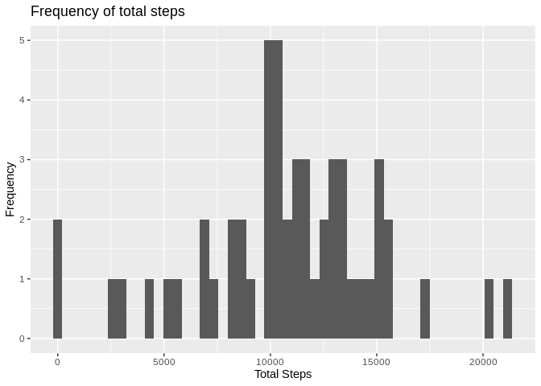
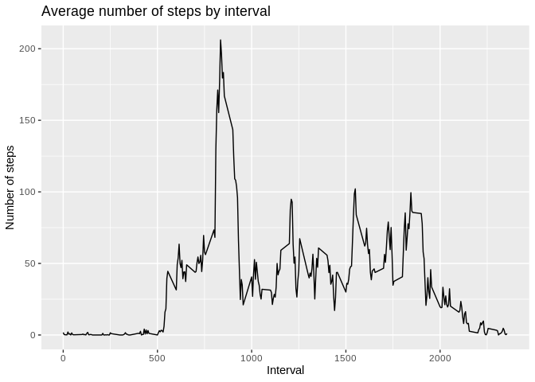
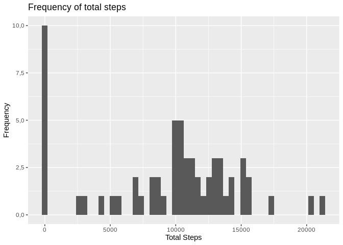
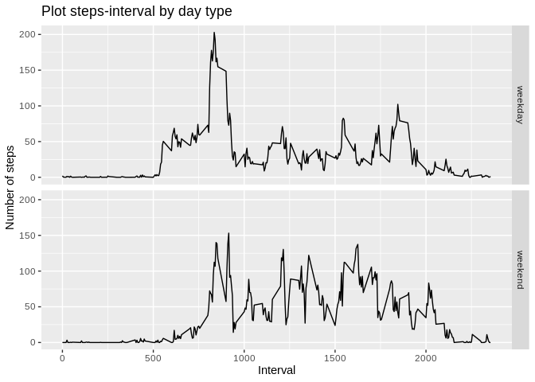

## Loading and preprocessing the data

```r
source("utils.R")
```

```
## 
## Attaching package: 'dplyr'
```

```
## The following objects are masked from 'package:stats':
## 
##     filter, lag
```

```
## The following objects are masked from 'package:base':
## 
##     intersect, setdiff, setequal, union
```

```r
data <- load_data()
```


## What is mean total number of steps taken per day?

```r
data_per_day <- get_total_steps_per_day(data)

ggplot(data_per_day, aes(x = total_steps)) +
    geom_histogram(bins = 50) +
    ggtitle("Frequency of total steps") +
    xlab("Total Steps") +
    ylab("Frequency")
```

```
## Warning: Removed 8 rows containing non-finite values (stat_bin).
```

<!-- -->

```r
overall_mean <- mean(data_per_day$total_steps, na.rm = TRUE)
overall_median <- median(data_per_day$total_steps, na.rm = TRUE)
```

- The mean value for the total steps per day is 1,0766189\times 10^{4} and the median 10765.


## What is the average daily activity pattern?

```r
data_per_interval <- get_mean_per_interval(data)

ggplot(data_per_interval, aes(x=interval, y=mean_value)) +
    geom_line() +
    ggtitle("Average number of steps by interval") +
    xlab("Interval") +
    ylab("Number of steps")
```

<!-- -->

```r
max_interval <- (data_per_interval %>%
                    filter(mean_value == max(mean_value)))$interval
```

- The maximum number of steps is in interval 835.


## Imputing missing values

```r
data_no_na <- impute_data_with_median(data)
data_per_day_no_na <- get_total_steps_per_day(data_no_na)

total_missing_values <- sum(is.na(data$steps))
total_zero_values <- sum(data$steps==0, na.rm = TRUE)
ggplot(data_per_day_no_na, aes(x = total_steps)) +
        geom_histogram(bins = 50) +
        ggtitle("Frequency of total steps") +
        xlab("Total Steps") +
        ylab("Frequency")
```

<!-- -->

```r
overall_mean_no_na <- mean(data_per_day_no_na$total_steps)
overall_median_no_na <- median(data_per_day_no_na$total_steps)
```

- There are 2304 missing values.
- Missing values were replaced by the median of each day.
- With imputed values, the mean value for the total steps per day is 9354,2295082 and the median 1,0395\times 10^{4}.
- These values for mean and median doesn't differ from the previous result because missing values were substituted by zero (median per day).


## Are there differences in activity patterns between weekdays and weekends?

```r
data_per_interval_and_type <- mean_by_day_type(data_no_na)

ggplot(data_per_interval_and_type, aes(x = interval, y = mean_value)) +
        geom_line() +
        facet_grid(type ~ .) +
        ggtitle("Plot steps-interval by day type") +
        xlab("Interval") +
        ylab("Number of steps")
```

<!-- -->
